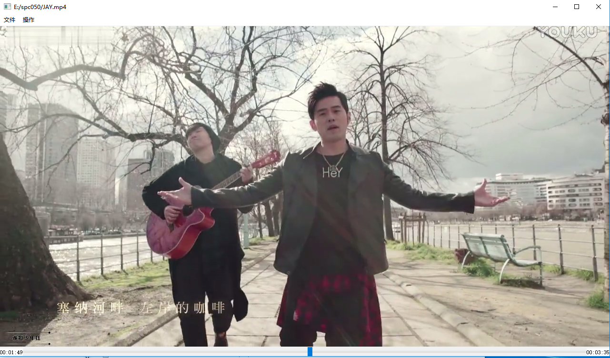

# X_Player
X_Player created by collen(qiujielu)
rename : ColorPlayer
The environment：ffmpeg lib/lld(32bit) SDL2 lib/lld(32bit) QT5_vs2013(32bit) vs2013  
features supported  
1.video/audio free run;  
2.UI can dynamic scale whatever sizes you want;  
3.video audio sync function;  
4.seek function,you can seek anywhere you want seek;  
5.reopen other files when playing;  
6.pause function;  
7.UI can show play time;  
8.support play live stream;  
more features to be done!welcome to development the player,thx!  

Now she looks like this  

  
